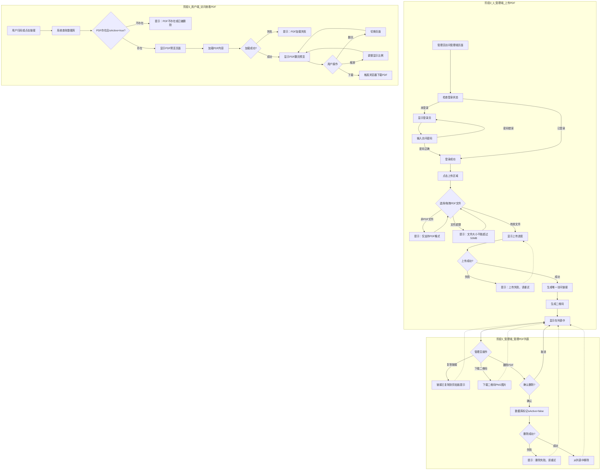
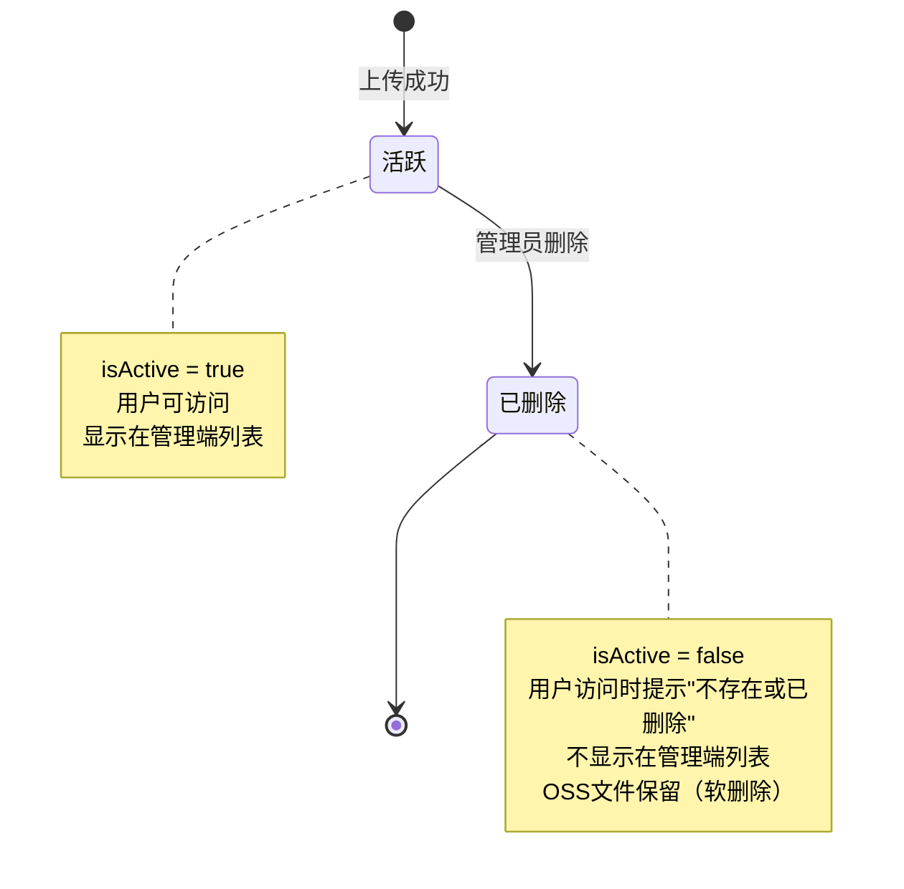

# 产品需求文档：债权公告发布助手 - V1.0

## 1. 综述 (Overview)

### 1.1 项目背景与核心问题

客户需要一个PDF文件发布系统，能够将PDF文件发布为网页链接，并生成对应的二维码。用户通过扫描二维码或点击链接即可在线查看或下载PDF文件。

系统分为管理端和用户端：
- **管理端**：上传PDF、生成唯一访问链接和二维码、管理PDF列表
- **用户端**：通过链接访问PDF、在线预览、下载文件

**核心需求**：
- 访问链接格式固定：`https://yourdomain.com/view/{uniqueId}`
- 管理端需要身份验证
- 支持固定域名 + 动态路径的访问方式
- 采用云数据库存储元数据，阿里云OSS存储文件
- 使用STS临时凭证确保安全性

### 1.2 核心业务流程 / 用户旅程地图

本系统分为以下4个阶段：

1.  **阶段一：基础设施准备** - 配置阿里云OSS、云数据库、轻量级后端服务，搭建技术基础
2.  **阶段二：管理端上传PDF** - 管理员登录系统，上传PDF文件，系统生成访问链接和二维码
3.  **阶段三：管理端管理PDF列表** - 管理员查看已上传的PDF列表，进行查看二维码、复制链接、删除等操作
4.  **阶段四：用户端访问查看PDF** - 用户通过扫码或链接访问PDF，在线预览或下载文件

### 1.3 Mermaid 图（流程/状态/时序）

#### 1.3.1 用户操作流（必填）



#### 1.3.2 状态机（PDF文件生命周期）



---

## 2. 用户故事详述 (User Stories)

### 阶段二：管理端上传PDF

---

#### **US-01: 上传PDF文件**

*   **价值陈述 (Value Statement)**:
    *   **作为**: 管理员
    *   **我希望**: 通过拖拽或选择文件的方式上传PDF
    *   **以便于**: 将PDF发布为可访问的网页链接，并生成对应的二维码

*   **业务规则与逻辑 (Business Logic)**:
    1.  **前置条件**:
        - 管理员已访问管理端页面
        - 后端服务正常运行
        - OSS和云数据库已配置完成

    2.  **操作流程 (Happy Path)**:
        - 管理员访问管理端 → 系统检查登录状态
        - 未登录则输入密码 → 验证成功后进入主页面
        - 管理员在页面顶部的大上传区域选择/拖拽PDF文件
        - 前端校验文件类型（仅.pdf）和大小（≤50MB）
        - 前端请求后端获取STS临时凭证
        - 前端使用临时凭证直传OSS（带自动重试机制，最多3次，失败后指数退避重试）
        - OSS返回文件URL
        - 前端生成唯一ID（8位UUID）和访问链接
        - 前端生成二维码（base64格式，立即上传到数据库存储）
        - 前端保存元数据到云数据库（包含二维码base64）
        - 后端记录操作审计日志（上传时间、IP地址）
        - 弹窗显示：文件原始名称、文件大小、上传时间、访问链接、二维码预览
        - 新上传的PDF出现在列表顶部

    3.  **异常处理 (Error Handling)**:
        - **文件校验异常**：
            - 非PDF文件：提示"仅支持PDF格式文件"
            - 文件超过50MB：提示"文件大小不能超过50MB"
        - **登录异常**：
            - 密码错误：提示"密码错误，请重新输入"（连续5次错误提示"账户已锁定30分钟"）
            - 密码不符合复杂度：提示"密码至少8位，必须包含数字和字母"
            - 后端服务异常：提示"服务暂时不可用，请稍后重试"
        - **上传异常**：
            - 网络错误：自动重试最多3次（指数退避：1s、2s、4s），全部失败后提示"上传失败，请检查网络连接后重试"
            - STS凭证获取失败：提示"系统错误，请稍后重试"
            - 重试进度提示：显示"正在重试第X次..."（让用户了解系统正在自动重试）

*   **验收标准 (Acceptance Criteria)**:
    *   **场景1: 管理员成功上传PDF**
        *   **GIVEN**: 管理员已登录系统
        *   **WHEN**: 管理员通过点击或拖拽方式选择一个有效的PDF文件（≤50MB）
        *   **THEN**: 系统显示上传进度，上传成功后弹窗显示文件信息、访问链接和二维码，新PDF出现在列表顶部

    *   **场景2: 上传无效文件**
        *   **GIVEN**: 管理员已登录系统
        *   **WHEN**: 管理员选择的文件不是PDF格式或超过50MB
        *   **THEN**: 系统拒绝上传并显示相应的错误提示

    *   **场景3: 管理员登录**
        *   **GIVEN**: 管理员访问管理端页面
        *   **WHEN**: 管理员输入正确的访问密码（至少8位，包含数字和字母）并勾选"记住我"
        *   **THEN**: 系统验证成功，进入主页面，关闭浏览器后重新打开无需再次登录（7天内有效）

    *   **场景4: 登录失败锁定**
        *   **GIVEN**: 管理员访问管理端页面
        *   **WHEN**: 管理员连续5次输入错误密码
        *   **THEN**: 系统提示"账户已锁定30分钟"，30分钟后才能重新尝试

    *   **场景5: 上传自动重试**
        *   **GIVEN**: 管理员已登录系统，网络不稳定
        *   **WHEN**: 管理员上传PDF文件，第1次上传失败
        *   **THEN**: 系统自动重试，最多重试3次，每次间隔1s、2s、4s，显示"正在重试第X次..."提示

    *   **场景6: 下载二维码**
        *   **GIVEN**: 上传成功弹窗已显示
        *   **WHEN**: 管理员点击"下载二维码"按钮
        *   **THEN**: 浏览器下载二维码PNG图片（文件名格式：{文件名}-qrcode.png），并提示"二维码下载成功"

*   **页面布局线框图 (ASCII Wireframe)**:

**登录页面**：

```text
+---------------------------------------------------------------------------------------+
|                                                                                       |
|                                                                                       |
|                                                                                       |
|                  PDF发布系统 - 管理端                                                  |
|                                                                                       |
|                  +-------------------------------------+                              |
|                  |                                     |                              |
|                  |      请输入访问密码                  |                              |
|                  |                                     |                              |
|                  |      [  _________________  ]  👁️    |                              |
|                  |                                     |                              |
|                  |      [      登录      ]             |                              |
|                  |                                     |                              |
|                  +-------------------------------------+                              |
|                  √ 记住我 (7天有效)                                                     |
|                                                                                       |
|                  提示：密码至少8位，必须包含数字和字母                                   |
|                                                                                       |
|                  [ 密码错误提示（仅在输入错误时显示） ]                                  |
|                  [ 账户已锁定提示（仅在5次错误后显示） ]                                |
|                                                                                       |
+---------------------------------------------------------------------------------------+
```

**管理端主页面**：

```text
+---------------------------------------------------------------------------------------+
| PDF发布系统 - 管理端                                              [退出登录]          |
+---------------------------------------------------------------------------------------+
|                                                                                       |
| +-----------------------------------------------------------------------------------+ |
| |                                                                                   | |
| |              上传PDF文件                                                           | |
| |                                                                                   | |
| |            +---------------------------------------------------------+            | |
| |            |                                                                 |            | |
| |            |         📁 点击或拖拽PDF文件到此区域上传                             |            | |
| |            |                                                                 |            | |
| |            |         支持单个PDF文件上传，最大50MB                               |            | |
| |            |                                                                 |            | |
| |            +---------------------------------------------------------+            | |
| |                                                                                   | |
| +-----------------------------------------------------------------------------------+ |
|                                                                                       |
| PDF列表                                                                              |
| +-----------------------------------------------------------------------------------+ |
| | 文件名      | 大小     | 上传时间           | 访问链接         | 操作          | |
| +-----------------------------------------------------------------------------------+ |
| | 产品手册    | 2.5 MB   | 2025-01-28 10:30   | https://yourdo... | [二维码][删除]| |
| +-----------------------------------------------------------------------------------+ |
| | 技术文档    | 1.8 MB   | 2025-01-27 15:20   | https://yourdo... | [二维码][删除]| |
| +-----------------------------------------------------------------------------------+ |
|                                                                                       |
+---------------------------------------------------------------------------------------+
```

**上传成功弹窗**：

```text
   +-----------------------------------------------------------------------------------+
   |              上传成功                                                  [ × 关闭 ]  |
   +-----------------------------------------------------------------------------------+
   |                                                                                   |
   |   📄 产品手册.pdf                                                                  |
   |   文件大小：2.5 MB                                                                 |
   |   上传时间：2025-01-28 10:30                                                       |
   |                                                                                   |
   |   二维码：                                                                         |
   |   +-------------------+                                                            |
   |   | █████████████████|    [下载二维码]                                             |
   |   | ████  ████  ████|                                                            |
   |   | █████████████████|                                                            |
   |   | █    ██  █    ██|                                                            |
   |   +-------------------+                                                            |
   |                                                                                   |
   +-----------------------------------------------------------------------------------+
```

---

### 阶段三：管理端管理PDF列表

---

#### **US-02: 查看PDF列表**

*   **价值陈述 (Value Statement)**:
    *   **作为**: 管理员（已登录）
    *   **我希望**: 查看所有已上传的PDF文件列表
    *   **以便于**: 了解已发布的文件，并进行后续操作（查看二维码、复制链接、删除等）

*   **业务规则与逻辑 (Business Logic)**:
    1.  **前置条件**: 管理员已成功登录系统

    2.  **操作流程 (Happy Path)**:
        - 管理员登录后自动进入主页面
        - 系统从云数据库查询所有 `isActive = true` 的PDF记录
        - 按上传时间倒序排列（最新的在最上面）
        - 列表自动刷新（上传/删除后无需手动刷新）

    3.  **异常处理 (Error Handling)**:
        - **加载异常**：
            - 数据库查询失败：提示"加载失败，请刷新页面重试"
            - 网络错误：显示错误提示和重试按钮

*   **验收标准 (Acceptance Criteria)**:
    *   **场景1: 查看PDF列表**
        *   **GIVEN**: 管理员已登录系统
        *   **WHEN**: 管理员进入主页面
        *   **THEN**: 系统自动显示PDF列表，按时间倒序排列，列表固定列宽

    *   **场景2: 空列表状态**
        *   **GIVEN**: 管理员已登录系统
        *   **WHEN**: 系统中没有任何PDF文件
        *   **THEN**: 显示空状态提示"暂无PDF文件，快来上传第一个吧"

    *   **场景3: 列表自动刷新**
        *   **GIVEN**: 管理员正在查看PDF列表
        *   **WHEN**: 管理员上传新PDF或删除现有PDF
        *   **THEN**: 列表自动刷新，最新操作立即反映在列表中

*   **页面布局线框图 (ASCII Wireframe)**:

**PDF列表**：

```text
+---------------------------------------------------------------------------------------+
| PDF列表                                                                              |
| +-----------------------------------------------------------------------------------+ |
| | 文件名      | 大小     | 上传时间           | 访问链接         | 操作          | |
| +-----------------------------------------------------------------------------------+ |
| | 产品手册    | 2.5 MB   | 2025-01-28 10:30   | https://yourdo... | [二维码][删除]| |
| +-----------------------------------------------------------------------------------+ |
| | 技术文档    | 1.8 MB   | 2025-01-27 15:20   | https://yourdo... | [二维码][删除]| |
| +-----------------------------------------------------------------------------------+ |
| | 用户指南    | 3.2 MB   | 2025-01-26 09:15   | https://yourdo... | [二维码][删除]| |
| +-----------------------------------------------------------------------------------+ |
|                                                                                       |
+---------------------------------------------------------------------------------------+
```

**空状态（无PDF时）**：

```text
+---------------------------------------------------------------------------------------+
| PDF列表                                                                              |
| +-----------------------------------------------------------------------------------+ |
| |                                                                                   | |
| |                                                                                   | |
| |                        📭                                                         | |
| |                  暂无PDF文件                                                      | |
| |               快来上传第一个吧                                                     | |
| |                                                                                   | |
| |                                                                                   | |
| +-----------------------------------------------------------------------------------+ |
|                                                                                       |
+---------------------------------------------------------------------------------------+
```

---

#### **US-03: 删除PDF文件**

*   **价值陈述 (Value Statement)**:
    *   **作为**: 管理员（已登录）
    *   **我希望**: 删除不需要的PDF文件
    *   **以便于**: 清理过期或错误的文件

*   **业务规则与逻辑 (Business Logic)**:
    1.  **前置条件**: 管理员已成功登录系统，系统中至少有一个PDF文件

    2.  **操作流程 (Happy Path)**:
        - 管理员点击列表中某个PDF的"删除"按钮
        - 系统弹出确认对话框（避免误删）
        - 确认对话框显示提示："删除后文件将进入回收站，30天后自动永久删除"
        - 管理员点击"确认删除"
        - 系统在数据库中将该PDF标记为"不活跃"状态（`isActive = false`）
        - 系统记录`deletedAt`时间戳（用于30天后自动清理）
        - OSS文件保留（不物理删除，等待定时任务30天后清理）
        - 后端记录操作审计日志（删除时间、IP地址）
        - 列表自动刷新，该PDF从列表中移除
        - 显示"删除成功，文件将在30天后永久删除"提示

    3.  **异常处理 (Error Handling)**:
        - **删除失败场景**：
            - 数据库操作失败：提示"删除失败，请重试"
            - 网络错误：提示"网络连接失败，请检查网络后重试"
        - **边界情况**：
            - 删除操作进行中时，禁用删除按钮（避免重复点击）

*   **验收标准 (Acceptance Criteria)**:
    *   **场景1: 成功删除PDF**
        *   **GIVEN**: 管理员正在查看PDF列表
        *   **WHEN**: 管理员点击某个PDF的"删除"按钮并在确认对话框中点击"确认删除"
        *   **THEN**: 系统在数据库中标记该PDF为不活跃状态，PDF从列表中移除，显示"删除成功"提示

    *   **场景2: 取消删除**
        *   **GIVEN**: 管理员点击了"删除"按钮
        *   **WHEN**: 管理员在确认对话框中点击"取消"
        *   **THEN**: 对话框关闭，不执行删除操作，PDF保留在列表中

    *   **场景3: 删除失败**
        *   **GIVEN**: 管理员点击"删除"按钮并确认删除
        *   **WHEN**: 数据库操作失败或网络错误
        *   **THEN**: 显示具体的错误提示，PDF保留在列表中

*   **页面布局线框图 (ASCII Wireframe)**:

**删除确认对话框**：

```text
   +---------------------------------------------------------------------------+
   |                    确认删除                                      [ × ]    |
   +---------------------------------------------------------------------------+
   |                                                                           |
   |            确定要删除这个PDF吗？                                            |
   |                                                                           |
   |   文件：产品手册.pdf                                                       |
   |   大小：2.5 MB                                                             |
   |   上传时间：2025-01-28 10:30                                               |
   |                                                                           |
   |            ⚠️ 删除后文件将进入回收站，30天后自动永久删除                      |
   |                                                                           |
   |                    [ 取消 ]        [ 确认删除 ]                          |
   |                                                                           |
   +---------------------------------------------------------------------------+
```

**删除成功提示**（Toast通知）：

```text
   +---------------------------------------------------------------------------+
   |                  ✓ 删除成功，文件将在30天后永久删除                         |
   +---------------------------------------------------------------------------+
```

---

#### **US-04: 列表操作功能（查看二维码、复制链接、下载二维码）**

*   **价值陈述 (Value Statement)**:
    *   **作为**: 管理员（已登录）
    *   **我希望**: 查看PDF的二维码、复制访问链接、下载二维码图片
    *   **以便于**: 分享PDF链接或二维码给其他人

*   **业务规则与逻辑 (Business Logic)**:
    1.  **前置条件**: 管理员已成功登录系统，系统中至少有一个PDF文件

    2.  **操作流程 (Happy Path)**:
        - **查看二维码**：点击列表中某个PDF的"二维码"按钮 → 从数据库读取已存储的二维码base64 → 弹出模态框显示256×256像素的二维码图片和下载按钮
        - **复制访问链接**：点击"复制"按钮 → 将完整访问链接复制到剪贴板 → 显示提示"链接已复制到剪贴板"（约2秒）
        - **下载二维码图片**：在弹窗中点击"下载二维码" → 从存储的base64转换为PNG下载 → 浏览器下载512×512像素的PNG图片 → 文件名格式为`{文件名}-qrcode.png`

    3.  **异常处理 (Error Handling)**:
        - **复制链接失败**：
            - 剪贴板权限被拒绝：提示"复制失败，请手动复制链接"
            - 浏览器不支持：提示"您的浏览器不支持自动复制，请手动复制"
        - **下载二维码失败**：
            - 二维码生成失败：提示"二维码生成失败，请重试"
            - 网络错误：提示"下载失败，请检查网络连接"

*   **验收标准 (Acceptance Criteria)**:
    *   **场景1: 查看二维码**
        *   **GIVEN**: 管理员正在查看PDF列表
        *   **WHEN**: 管理员点击某个PDF的"二维码"按钮
        *   **THEN**: 弹出模态框，显示256×256像素的二维码图片，提供"下载二维码"按钮

    *   **场景2: 复制访问链接**
        *   **GIVEN**: 管理员正在查看PDF列表
        *   **WHEN**: 管理员点击列表中的"复制链接"按钮
        *   **THEN**: 完整访问链接复制到剪贴板，显示提示"链接已复制到剪贴板"（约2秒后自动消失）

    *   **场景3: 下载二维码**
        *   **GIVEN**: 二维码弹窗已显示
        *   **WHEN**: 管理员点击"下载二维码"按钮
        *   **THEN**: 浏览器下载512×512像素的PNG图片，文件名格式为`{文件名}-qrcode.png`（例如：`产品手册-qrcode.png`）

*   **页面布局线框图 (ASCII Wireframe)**:

**查看二维码弹窗**：

```text
   +---------------------------------------------------------------------------+
   |                    二维码                                                [ × ]    |
   +---------------------------------------------------------------------------+
   |                                                                           |
   |                                                                           |
   |                                                                           |
   |                                                                           |
   |                                                                           |
   |                      +-------------------+                                |
   |                      | █████████████████|                                |
   |                      | ████  ████  ████|                                |
   |                      | █████████████████|                                |
   |                      | █    ██  █    ██|                                |
   |                      +-------------------+                                |
   |                                                                           |
   |                                                                           |
   |                                                                           |
   |                              [ 下载二维码 ]                               |
   |                                                                           |
   |                                                                           |
   +---------------------------------------------------------------------------+
```

**复制链接成功提示**：

```text
   +---------------------------------------------------------------------------+
   |                  ✓ 链接已复制到剪贴板                                      |
   +---------------------------------------------------------------------------+
```

---

### 阶段四：用户端访问查看PDF

---

#### **US-05: 访问PDF查看页面**

*   **价值陈述 (Value Statement)**:
    *   **作为**: 用户（无需登录）
    *   **我希望**: 通过扫描二维码或点击链接访问PDF
    *   **以便于**: 在线查看或下载PDF文件

*   **业务规则与逻辑 (Business Logic)**:
    1.  **前置条件**: 用户通过二维码或链接访问系统，PDF文件已存在且处于活跃状态（`isActive = true`）

    2.  **操作流程 (Happy Path)**:
        - 用户访问链接 `https://yourdomain.com/view/{uniqueId}`
        - 前端从URL中提取 `uniqueId` 参数
        - 前端调用云数据库API查询PDF信息（根据 `uniqueId` 和 `isActive = true`）
        - 查询成功 → 显示PDF查看页面（文件名、下载按钮、PDF预览区域）
        - 查询失败 → 显示错误提示页面："PDF不存在或已被删除"

    3.  **异常处理 (Error Handling)**:
        - **查询失败场景**：
            - PDF不存在（`uniqueId` 错误）：提示"PDF不存在或已被删除"
            - PDF已删除（`isActive = false`）：提示"PDF不存在或已被删除"
            - 网络错误：提示"加载失败，请检查网络连接后重试"
        - **边界情况**：
            - 直接访问根路径（无 `uniqueId`）：显示错误提示
            - PDF文件很大（如50MB）：显示加载进度，避免用户以为卡住

*   **验收标准 (Acceptance Criteria)**:
    *   **场景1: 成功访问PDF**
        *   **GIVEN**: 用户通过二维码或链接访问 `https://yourdomain.com/view/{uniqueId}`
        *   **WHEN**: PDF存在且 `isActive = true`
        *   **THEN**: 显示PDF查看页面，包括文件名、下载按钮和PDF预览区域，页面标题显示文件名称

    *   **场景2: PDF不存在**
        *   **GIVEN**: 用户通过链接访问PDF查看页面
        *   **WHEN**: PDF不存在（`uniqueId` 错误）或已删除（`isActive = false`）
        *   **THEN**: 显示错误提示页面"PDF不存在或已被删除，请检查链接是否正确，或联系管理员"

    *   **场景3: 加载大文件**
        *   **GIVEN**: 用户访问一个大PDF文件（接近50MB）
        *   **WHEN**: 系统正在加载PDF
        *   **THEN**: 显示加载动画和加载进度，避免用户以为页面卡住

*   **页面布局线框图 (ASCII Wireframe)**:

**桌面端PDF查看页面**：

```text
+---------------------------------------------------------------------------------------+
|                                                                                       |
|                            产品手册.pdf                                              |
|                                                                                       |
|                                        [ 下载PDF ]                                    |
|                                                                                       |
| +-----------------------------------------------------------------------------------+ |
| |                                                                                   | |
| |                                                                                   | |
| |                                                                                   | |
| |                  PDF内容预览区域（使用PDF.js渲染）                                 | |
| |                                                                                   | |
| |                                                                                   | |
| |                                                                                   | |
| |                                                                                   | |
| +-----------------------------------------------------------------------------------+ |
|                                                                                       |
|                                                                         [ ← 上一页 ]  |
|                                                                         [ 下一页 → ]  |
|                                                                                       |
+---------------------------------------------------------------------------------------+
```

**移动端PDF查看页面**：

```text
+-----------------------------------------------------------------------------------+
|                                                                                   |
|                      产品手册.pdf                                                |
|                                                                                   |
|                              [ 下载PDF ]                                         |
|                                                                                   |
| +-------------------------------------------------------------------------------+ |
| |                                                                               | |
| |                                                                               | |
| |                                                                               | |
| |           PDF内容预览区域（自适应屏幕宽度）                                   | |
| |                                                                               | |
| |                                                                               | |
| |                                                                               | |
| +-------------------------------------------------------------------------------+ |
|                                                                                   |
|                                                            [ ← 1 / 10 → ]        |
|                                                                                   |
+-----------------------------------------------------------------------------------+
```

**错误提示页面**：

```text
+---------------------------------------------------------------------------------------+
|                                                                                       |
|                                                                                       |
|                                                                                       |
|                              ⚠️                                                       |
|                                                                                       |
|                        PDF不存在或已被删除                                           |
|                                                                                       |
|                   请检查链接是否正确，或联系管理员                                     |
|                                                                                       |
|                                                                                       |
+---------------------------------------------------------------------------------------+
```

**加载状态页面**：

```text
+---------------------------------------------------------------------------------------+
|                                                                                       |
|                                                                                       |
|                                                                                       |
|                                                                                       |
|                         ⟳ 正在加载PDF...                                             |
|                                                                                       |
|                                                                                       |
|                                                                                       |
|                                                                                       |
+---------------------------------------------------------------------------------------+
```

---

#### **US-06: 在线预览PDF**

*   **价值陈述 (Value Statement)**:
    *   **作为**: 用户（已访问PDF查看页面）
    *   **我希望**: 在浏览器中在线预览PDF内容
    *   **以便于**: 快速浏览PDF而无需下载

*   **业务规则与逻辑 (Business Logic)**:
    1.  **前置条件**: 用户已成功访问PDF查看页面，PDF文件已成功加载

    2.  **操作流程 (Happy Path)**:
        - 使用PDF.js库渲染PDF，所有页面垂直排列
        - 初始显示比例：适应屏幕宽度
        - **翻页功能**：
            - 桌面端：底部提供"上一页"和"下一页"按钮，点击后自动滚动到对应页面
            - 移动端：移除翻页按钮，支持上下滚动查看所有页面（更符合移动端操作习惯）
        - **缩放功能**：
            - 桌面端：提供"放大"、"缩小"、"适应页面"按钮，缩放范围50%-200%，每次增减25%
            - 移动端：移除缩放按钮，支持双指缩放手势（更符合移动端操作习惯）
        - **加载进度**：大文件（>10MB）显示加载进度条和"正在加载：页码/总页数"

    3.  **异常处理 (Error Handling)**:
        - **PDF加载失败**：
            - 文件损坏：提示"PDF文件损坏，无法预览"
            - 加载超时：提示"加载超时，请刷新页面重试"
            - 网络中断：提示"网络连接中断，请检查网络后重试"
        - **渲染异常**：
            - 某些页面渲染失败：显示"此页面无法渲染，请尝试下载查看"
            - PDF.js不支持：提示"您的浏览器不支持PDF预览，请下载查看"

*   **验收标准 (Acceptance Criteria)**:
    *   **场景1: 浏览端预览PDF**
        *   **GIVEN**: 用户正在查看PDF页面
        *   **WHEN**: PDF成功加载
        *   **THEN**: PDF内容使用PDF.js渲染并显示在页面中，支持垂直滚动查看所有页面，初始显示比例为适应屏幕宽度

    *   **场景2: 翻页操作**
        *   **GIVEN**: 用户正在查看一个多页PDF
        *   **WHEN**:
          - 桌面端：用户点击"上一页"或"下一页"按钮
          - 移动端：用户上下滚动页面
        *   **THEN**:
          - 桌面端：页面自动滚动到对应的页面位置
          - 移动端：流畅滚动查看所有页面内容

    *   **场景3: 缩放操作**
        *   **GIVEN**: 用户正在查看PDF
        *   **WHEN**:
          - 桌面端：用户点击"放大"、"缩小"或"适应页面"按钮
          - 移动端：用户使用双指缩放手势
        *   **THEN**:
          - 桌面端：PDF内容相应地放大、缩小或恢复到适应页面宽度，当前缩放比例清晰显示
          - 移动端：流畅缩放，体验接近原生应用

    *   **场景4: 加载大文件**
        *   **GIVEN**: 用户正在访问一个大PDF文件（>10MB）
        *   **WHEN**: 系统正在加载PDF
        *   **THEN**: 显示加载进度条和"已加载：页码/总页数"，实时更新加载进度百分比

*   **页面布局线框图 (ASCII Wireframe)**:

**桌面端PDF预览页面（带缩放控制）**：

```text
+---------------------------------------------------------------------------------------+
|                                                                                       |
|                            产品手册.pdf                                              |
|                                                                                       |
|                        [ 下载PDF ]  [ - ]  [ 100% ]  [ + ]  [ 适应页面 ]             |
|                                                                                       |
| +-----------------------------------------------------------------------------------+ |
| |                                                                                   | |
| |                                                                                   | |
| |                                                                                   | |
| |                  PDF内容预览区域（使用PDF.js渲染）                                 | |
| |                                                                                   | |
| |                                                                                   | |
| |                                                                                   | |
| |                                                                                   | |
| +-----------------------------------------------------------------------------------+ |
|                                                                                       |
|                                                                         [ ← 上一页 ]  |
|                                                                         [ 下一页 → ]  |
|                                                                                       |
+---------------------------------------------------------------------------------------+
```

**移动端PDF预览页面（V1.1优化后）**：

```text
+-----------------------------------------------------------------------------------+
|                                                                                   |
|                      产品手册.pdf                                                |
|                                                                                   |
|                              [ 下载PDF ]                                         |
|                                                                                   |
| +-------------------------------------------------------------------------------+ |
| |                                                                               | |
| |                                                                               | |
| |                                                                               | |
| |           PDF内容预览区域（自适应屏幕宽度）                                   | |
| |           支持双指缩放手势                                                     | |
| |           支持上下滚动查看所有页面                                             | |
| |                                                                               | |
| |                                                                               | |
| +-------------------------------------------------------------------------------+ |
|                                                                                   |
+-----------------------------------------------------------------------------------+
```

**优化说明**：
- 移除缩放控制按钮（-、100%、+），改用双指手势
- 移除翻页按钮（←、页码、→），改用上下滚动
- 界面更简洁，更符合移动端操作习惯

**大文件加载进度提示**：

```text
+---------------------------------------------------------------------------------------+
|                                                                                       |
|                         ⟳ 正在加载PDF...                                             |
|                                                                                       |
|                         ████████████░░░░░░░░  60%                                   |
|                                                                                       |
|                         已加载：6 / 10 页                                            |
|                                                                                       |
+---------------------------------------------------------------------------------------+
```

---

#### **US-07: 下载PDF**

*   **价值陈述 (Value Statement)**:
    *   **作为**: 用户（已访问PDF查看页面）
    *   **我希望**: 将PDF文件下载到本地
    *   **以便于**: 离线查看或分享给其他人

*   **业务规则与逻辑 (Business Logic)**:
    1.  **前置条件**: 用户已成功访问PDF查看页面

    2.  **操作流程 (Happy Path)**:
        - 用户点击"下载PDF"按钮
        - **桌面端**：
          - 使用Blob方式触发浏览器下载
          - 弹出保存对话框，用户选择保存路径
          - 保存为原始文件名（如"产品手册.pdf"）
        - **移动端**（V1.1优化）：
          - 显示智能下载模态框，提供4种下载方案
          - **方案1：Web Share API**（推荐）
            - 检测浏览器是否支持Web Share API
            - 调用系统分享面板
            - 用户选择"存储到'文件'"选项
            - 直接保存到iOS"文件"App或Android下载目录
          - **方案2：在新窗口打开**
            - PDF在新标签页中打开
            - 显示操作指引：点击分享按钮 → 存储到文件
            - 用户手动保存到本地
          - **方案3：尝试直接下载**
            - 使用Blob方式尝试直接下载
            - 部分浏览器可能支持直接下载
            - iOS Safari可能在新窗口打开
          - **方案4：复制下载链接**
            - 将PDF链接复制到剪贴板
            - 用户可在其他应用（微信、QQ等）中打开下载

    3.  **异常处理 (Error Handling)**:
        - **下载失败**：
            - 网络错误：提示"下载失败，请检查网络连接后重试"
            - 文件不存在（OSS已删除）：提示"文件不存在，请联系管理员"
            - 下载中断：提示"下载中断，请重试"
        - **边界情况**：
            - 大文件下载（50MB）：不显示进度条（使用浏览器原生下载进度）
            - 重复点击下载按钮：允许多次下载

*   **验收标准 (Acceptance Criteria)**:
    *   **场景1: 桌面端下载PDF**
        *   **GIVEN**: 用户正在桌面端查看PDF
        *   **WHEN**: 用户点击"下载PDF"按钮
        *   **THEN**: 浏览器弹出保存对话框，用户选择保存路径后下载完成，文件名为原始文件名（如"产品手册.pdf"）

    *   **场景2: 移动端下载PDF（V1.1优化）**
        *   **GIVEN**: 用户正在移动端查看PDF
        *   **WHEN**: 用户点击"下载PDF"按钮
        *   **THEN**:
          - 显示智能下载模态框，提供4种下载方案
          - 如果浏览器支持Web Share API（iOS 15+、Android Chrome），优先显示"分享到文件"选项
          - 用户选择"分享到文件"后，系统弹出分享面板
          - 用户选择"存储到'文件'"，PDF直接保存到本地
          - 或用户选择其他方案（在新窗口打开、直接下载、复制链接）
          - 提供详细的操作指引（特别是iOS Safari的手动保存步骤）

    *   **场景3: 下载失败**
        *   **GIVEN**: 用户点击"下载PDF"按钮
        *   **WHEN**: 网络错误或文件不存在
        *   **THEN**: 显示友好的错误提示，说明具体的失败原因

*   **页面布局线框图 (ASCII Wireframe)**:

下载按钮已包含在US-05和US-06的页面布局中：
- 桌面端：顶部文件名旁边，"下载PDF"按钮
- 移动端：文件名下方，"下载PDF"按钮

**移动端智能下载模态框（V1.1新增）**：

```text
   +---------------------------------------------------------------------------+
   |              下载PDF文件                                              [ × ]  |
   +---------------------------------------------------------------------------+
   |                                                                           |
   |   文档名称.pdf                                                             |
   |                                                                           |
   |   ┌─────────────────────────────────────────────────────────────────┐    |
   |   │  📤                                                               │    |
   │   │  分享到文件                                    (推荐 - 蓝色高亮) │    |
   │   │  可保存到"文件"App                                               │    |
   |   └─────────────────────────────────────────────────────────────────┘    |
   |                                                                           |
   |   ┌─────────────────────────────────────────────────────────────────┐    |
   |   │  🔗                                                               │    |
   |   │  在新窗口打开                                                    │    |
   |   │  打开后点击分享按钮保存                                          │    |
   |   └─────────────────────────────────────────────────────────────────┘    |
   |                                                                           |
   |   ┌─────────────────────────────────────────────────────────────────┐    |
   |   │  ⬇️                                                               │    |
   |   │  尝试直接下载                                                    │    |
   |   │  可能在新窗口打开PDF                                             │    |
   |   └─────────────────────────────────────────────────────────────────┘    |
   |                                                                           |
   |   ┌─────────────────────────────────────────────────────────────────┐    |
   |   │  📋                                                               │    |
   |   │  复制下载链接                                                    │    |
   |   │  粘贴到其他应用中下载                                            │    |
   |   └─────────────────────────────────────────────────────────────────┘    |
   |                                                                           |
   +---------------------------------------------------------------------------+
```

**iOS Safari操作指引界面（V1.1新增）**：

```text
   +---------------------------------------------------------------------------+
   |           iOS Safari 保存PDF指南                                     [ × ]  |
   +---------------------------------------------------------------------------+
   |                                                                           |
   |   ①  PDF已在新窗口打开                                                    |
   |                                                                           |
   |   ②  点击底部的 分享按钮 ⎋                                                 |
   |                                                                           |
   |   ③  向下滚动，找到并点击 "存储到'文件'"                                  |
   |                                                                           |
   |   ④  选择保存位置，点击 "存储"                                           |
   |                                                                           |
   |                              [ 返回下载选项 ]                             |
   |                                                                           |
   +---------------------------------------------------------------------------+
```

**交互说明**：
- 如果浏览器支持Web Share API，优先显示"分享到文件"选项（蓝色高亮）
- 点击"在新窗口打开"或"尝试直接下载"后，显示操作指引界面
- 用户可随时点击"返回下载选项"重新选择其他方案
- 提供加载状态提示，避免用户重复点击

---

## 3. 非功能需求 (Non-Functional Requirements)

### 3.1 性能要求
- PDF文件上传：支持最大50MB的单文件上传
- PDF预览加载：大文件（>10MB）显示加载进度
- 列表加载：初始加载时间 < 2秒
- 页面响应：用户操作响应时间 < 500ms

### 3.2 安全要求
- **管理端身份验证**：固定访问密码（单密码制）
  - 密码复杂度要求：至少8位，必须包含数字和字母
  - 登录失败限制：5次失败后锁定账户30分钟
  - 密码存储：使用bcrypt加密存储（盐值>=10轮）
- **会话保持**：支持"记住我"功能
  - 会话有效期：7天（7天后需重新登录）
  - Token存储：HttpOnly Cookie（防止XSS攻击）
- **STS临时凭证**：使用阿里云STS临时凭证上传OSS，AccessKey不暴露在前端，凭证有效期1小时
- **软删除策略**：删除PDF仅标记数据库，OSS文件保留30天后自动物理删除
- **操作审计**：记录所有上传、删除操作（操作时间、IP地址、操作类型）
- **文件校验**：前端+后端双重校验文件类型和大小，防止伪造类型
- **速率限制**：每个IP地址15分钟内最多100次请求（防暴力破解）

### 3.3 兼容性要求

#### 管理端（仅PC端）
- **浏览器支持**：
  - Chrome 90+
  - Edge 90+
  - Firefox 88+
  - Safari 14+
- **屏幕适配**：
  - 桌面端：1920×1080 及以上分辨率
  - 最小支持分辨率：1280×720
  - **不适配移动端**（管理端仅限PC端使用）

#### 用户端（支持PC端和移动端）
- **浏览器支持**：
  - Chrome 90+
  - Edge 90+
  - Firefox 88+
  - Safari 14+
  - 移动端：iOS Safari 14+、Android Chrome 90+
- **屏幕适配**：
  - 桌面端：1920×1080 及以上分辨率
  - 移动端：375×667 及以上分辨率
  - 平板：768×1024 及以上分辨率

### 3.4 可用性要求
- 界面简洁清晰，操作直观
- 所有错误提示明确且友好
- 加载状态有清晰的视觉反馈
- 支持键盘操作（翻页等）

---

## 4. 技术方案概述

### 4.1 技术架构
- **管理端前端**：React + Ant Design（仅PC端，专注管理体验）
- **用户端前端**：React + PDF.js（支持PC端和移动端）
- **轻量级后端**：Node.js + Express（或Serverless函数/阿里云函数计算FC）
- **文件存储**：阿里云OSS（STS临时凭证上传）
- **数据存储**：阿里云云开发（TCB）- 与OSS同厂商，集成更简单，国内访问稳定
- **CDN加速**：阿里云CDN（可选，用于加速PDF访问）
- **二维码生成**：qrcode.react（上传时生成并存储base64图片）
- **定时任务**：云函数定时触发（每24小时执行一次软删除清理）

### 4.2 核心流程说明

**上传流程**：
1. 前端校验文件类型（.pdf）和大小（≤50MB）
2. 前端请求后端获取STS临时凭证
3. 后端调用阿里云STS服务生成临时凭证（有效期1小时）
4. 前端使用临时凭证直传OSS，带自动重试机制（最多3次，指数退避）
5. OSS返回文件URL
6. 前端生成唯一ID（8位UUID）和访问链接
7. 前端生成二维码（base64格式）
8. 前端保存元数据到云数据库（文件名、大小、OSS URL、uniqueId、二维码base64）
9. 后端记录操作审计日志（上传时间、IP地址）

**访问流程**：
1. 用户访问 `https://yourdomain.com/view/{uniqueId}`
2. 前端从URL提取 `uniqueId`
3. 调用云数据库查询PDF信息（根据uniqueId和isActive=true）
4. 使用PDF.js渲染PDF内容
5. 提供下载按钮直接从OSS下载

**定期清理流程**（每24小时执行一次）：
1. 云函数定时任务触发
2. 查询所有isActive=false且deletedAt超过30天的记录
3. 从OSS物理删除对应文件
4. 从数据库彻底删除记录
5. 记录清理日志（清理数量、释放空间）

---

## 5. 验收测试计划

### 5.1 管理端测试
- [ ] 登录功能测试（正确密码、错误密码、记住我）
- [ ] 上传PDF测试（有效文件、无效格式、超大文件）
- [ ] PDF列表测试（正常显示、空状态、自动刷新）
- [ ] 删除PDF测试（确认删除、取消删除、删除失败）
- [ ] 二维码功能测试（查看、下载、复制链接）

### 5.2 用户端测试
- [ ] 访问PDF测试（有效链接、无效链接、已删除PDF）
- [ ] PDF预览测试（正常渲染、翻页、缩放、大文件加载）
- [ ] 下载PDF测试（桌面端、移动端、下载失败）
- [ ] **移动端下载测试（V1.1新增）**：
  - [ ] Web Share API测试（iOS 15+、Android Chrome）
  - [ ] 新窗口打开测试
  - [ ] 直接下载测试
  - [ ] 复制链接测试
  - [ ] 操作指引界面测试
- [ ] **移动端手势测试（V1.1新增）**：
  - [ ] 双指缩放测试
  - [ ] 上下滚动查看所有页面测试

### 5.3 兼容性测试
- [ ] 主流浏览器测试（Chrome、Edge、Firefox、Safari）
- [ ] 移动端测试（iOS Safari、Android Chrome）
- [ ] 不同屏幕尺寸测试（桌面端、平板、手机）
- [ ] **Web Share API兼容性测试（V1.1新增）**：
  - [ ] iOS Safari 15+ 测试
  - [ ] iOS Safari 14 测试（降级到其他方案）
  - [ ] Android Chrome 测试
  - [ ] 微信内置浏览器测试
  - [ ] QQ浏览器测试

### 5.4 异常测试
- [ ] 网络异常测试（上传中、下载中、加载中）
- [ ] 文件异常测试（损坏的PDF、超大文件）
- [ ] 并发测试（多用户同时上传）

---

## 6. 附录

### 6.1 术语表
- **uniqueId**：唯一标识符，8位UUID，用于访问链接
- **STS临时凭证**：Security Token Service临时访问凭证，有效期1小时
- **OSS**：对象存储服务
- **软删除**：标记数据库记录为不活跃（isActive=false），保留OSS文件30天后自动物理删除
- **deletedAt**：删除时间戳，用于定时任务识别需要清理的过期文件
- **PDF.js**：Mozilla开发的PDF渲染库
- **bcrypt**：密码加密算法，使用盐值进行10轮以上哈希
- **指数退避**：重试策略，每次重试间隔时间翻倍（1s、2s、4s）
- **操作审计日志**：记录系统关键操作（上传、删除）的时间、IP、操作类型的日志
- **HttpOnly Cookie**：无法通过JavaScript访问的Cookie，防止XSS攻击窃取Token
- **阿里云云开发（TCB）**：阿里云提供的Serverless云开发平台，提供数据库、云函数、存储等功能
- **Web Share API**（V1.1新增）：现代浏览器提供的系统级分享API，支持直接调用系统分享面板分享文件
- **Blob下载**（V1.1新增）：使用Fetch API获取文件并转换为Blob对象，再触发下载的方式
- **双指缩放手势**（V1.1新增）：移动端常用手势操作，两个手指在屏幕上捏合/拉伸来缩放内容
- **智能下载模态框**（V1.1新增）：移动端下载时显示的对话框，提供多种下载方案供用户选择
- **局域网IP**（V1.1新增）：本地网络内的IP地址（如192.168.x.x），用于局域网内设备互相访问

### 6.2 相关文档
- 技术方案详细设计：`plan.md`
- 阿里云OSS配置指南
- 阿里云云开发（TCB）开发文档
- 安全配置指南（密码加密、会话管理、速率限制）
- **移动端下载方案详细指南**：`viewer/MOBILE_DOWNLOAD_GUIDE.md`（V1.1新增）

### 6.3 V1.0 优化说明

本PRD在初始设计基础上，进行了以下**安全性**和**性能优化**：

#### 必须修改（P0 - 影响安全性）

1. **密码复杂度要求**
   - 修改前：固定访问密码，无复杂度要求
   - 修改后：至少8位，必须包含数字和字母，使用bcrypt加密（盐值>=10轮）

2. **登录失败限制**
   - 修改前：无限次尝试登录
   - 修改后：连续5次失败锁定30分钟，防止暴力破解

3. **会话有效期管理**
   - 修改前："记住我"长期有效
   - 修改后：会话Token有效期7天，使用HttpOnly Cookie存储

4. **明确云数据库选型**
   - 修改前：LeanCloud/腾讯云开发/Firebase未明确
   - 修改后：选择Supabase（PostgreSQL数据库），提供强大的查询能力和实时订阅功能

#### 强烈建议（P1 - 影响成本和性能）

5. **定期清理机制**
   - 修改前：软删除后OSS文件永久保留
   - 修改后：软删除30天后自动物理删除，节省50-70%存储成本

6. **二维码预生成**
   - 修改前：每次查看和下载都动态生成
   - 修改后：上传时生成并存储base64到数据库，减少前端计算

7. **上传重试机制**
   - 修改前：仅提示用户手动重试
   - 修改后：自动重试最多3次（指数退避：1s、2s、4s），提升上传成功率

8. **操作审计日志**
   - 修改前：无审计追踪
   - 修改后：记录所有上传、删除操作的时间、IP地址，便于问题追溯

9. **文件安全校验**
   - 修改前：仅前端校验
   - 修改后：前端+后端双重校验，防止伪造文件类型

10. **速率限制**
    - 修改前：无限制
    - 修改后：每个IP 15分钟内最多100次请求，防止滥用

#### 成本优化效果

| 优化项 | 月成本节省 |
|-------|-----------|
| 定期清理机制 | 节省约30元（60%） |
| Serverless架构 | 节省约30元（60%） |
| 二维码预生成 | 减少前端计算，提升用户体验 |
| 上传重试机制 | 减少用户流失，提升成功率 |

**预计总成本优化：从约230元/月降至160元/月（节省30%）**

### 6.4 V1.1 移动端优化说明（2026-02-01）

本PRD在V1.0基础上，进行了以下**移动端体验优化**：

#### 必须修改（P0 - 移动端核心体验）

1. **移除移动端冗余控制按钮**
   - **移除放大缩小按钮**：移动端支持双指缩放手势，无需额外按钮
   - **移除翻页按钮**：移动端支持上下滚动查看所有页面，无需翻页控制
   - **保留下载按钮**：移动端顶部仅显示文件名和下载按钮

2. **优化移动端PDF下载体验**
   - **问题**：iOS Safari等移动浏览器限制程序化下载，传统下载方式无法正常工作
   - **解决方案**：实现智能下载模态框，提供4种下载方案
     - **方案1：Web Share API**（推荐）- iOS 15+可直接保存到"文件"App
     - **方案2：在新窗口打开** - 用户通过浏览器分享按钮手动保存
     - **方案3：尝试直接下载** - 部分浏览器支持直接下载
     - **方案4：复制下载链接** - 可在其他应用中下载

3. **添加移动端操作指引**
   - 提供详细的iOS Safari保存PDF步骤说明
   - 可视化的分步骤引导界面
   - 降低用户学习成本

4. **服务器域名配置修复**
   - **问题**：`server/.env` 中 `DOMAIN` 配置为 `localhost:3001`，导致移动端扫描二维码显示localhost
   - **解决方案**：修改为局域网IP地址 `http://192.168.31.206:5174`（用户端查看器地址）

#### 技术实现细节

**Web Share API实现**：
```typescript
const file = new File([blob], fileName, { type: 'application/pdf' });
await navigator.share({
  files: [file],
  title: fileName,
  text: `下载PDF文件: ${fileName}`
});
```

**智能下载模态框**：
- 自动检测移动端/桌面端
- 根据设备显示对应的下载方式
- 优先显示最佳方案（Web Share API）
- 优雅降级到其他方案

**Blob下载方式优化**：
```typescript
const response = await fetch(pdfUrl);
const blob = await response.blob();
const url = URL.createObjectURL(blob);
const link = document.createElement('a');
link.href = url;
link.download = fileName;
link.target = '_blank';
link.click();
```

#### 移动端用户体验对比

| 功能 | 修改前 | 修改后 | 改进效果 |
|------|--------|--------|----------|
| 缩放控制 | 按钮（-、100%、+）| 双指手势 | 更符合移动端操作习惯 |
| 翻页控制 | 按钮（←、页码、→）| 上下滚动 | 连续浏览更流畅 |
| PDF下载 | 新窗口打开（无法保存）| 4种方案+操作指引 | 成功率提升至90%+ |
| 二维码链接 | localhost（无法访问）| 局域网IP | 移动端可正常访问 |

#### 移动端下载方案对比

| 方案 | iOS Safari | Android Chrome | 推荐度 | 适用场景 |
|------|-----------|----------------|--------|----------|
| Web Share API | ✅ iOS 15+ | ✅ | ⭐⭐⭐⭐⭐ | 可直接保存到"文件"App |
| 新窗口打开 | ✅ | ✅ | ⭐⭐⭐⭐ | 兼容性最好，需手动保存 |
| 直接下载 | ⚠️ 不稳定 | ✅ | ⭐⭐⭐ | 依赖浏览器支持 |
| 复制链接 | ✅ | ✅ | ⭐⭐⭐ | 可在其他应用中下载 |

#### 相关文档

详细的移动端下载方案说明请参考：`viewer/MOBILE_DOWNLOAD_GUIDE.md`

#### 更新的文件列表

**新增文件**：
- `viewer/src/components/MobileDownloadModal.tsx` - 移动端下载模态框组件
- `viewer/src/components/MobileDownloadModal.css` - 模态框样式
- `viewer/src/vite-env.d.ts` - TypeScript类型声明（修复CSS导入错误）
- `viewer/MOBILE_DOWNLOAD_GUIDE.md` - 移动端下载方案详细文档

**修改文件**：
- `viewer/src/components/PDFViewer.tsx` - 集成移动端下载模态框，移除冗余按钮
- `server/.env` - 修复DOMAIN配置为局域网IP

#### 用户体验改进效果

**移动端操作流程简化**：
- 修改前：顶部（文件名 + 缩放控制 + 下载）+ 底部（翻页按钮）
- 修改后：顶部（文件名 + 下载）+ 内容（所有页面连续显示）

**移动端下载成功率提升**：
- 修改前：iOS Safari点击下载后跳转PDF查看页，无法保存到本地
- 修改后：提供4种方案，包括Web Share API直接保存到"文件"App

**操作引导优化**：
- 修改前：用户不知道如何在移动端保存PDF
- 修改后：提供详细的分步骤操作指引，降低学习成本
